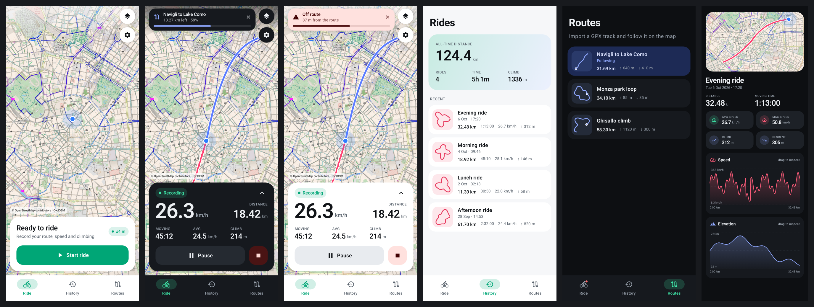

# Pedal: bike ride tracker for Android

A lightweight Kotlin + Jetpack Compose app for recording bike rides on OpenStreetMap or
satellite maps, and for following imported GPX routes.



## Features

- **Live tracking** in a foreground service, so recording continues with the screen off. Shows speed,
  distance, moving time, average and max speed, climb and descent, altitude and elapsed time.
- **Auto-pause** when you stop. Manual pause starts a new track segment, so the gap isn't joined by
  a straight line.
- **Maps** (all free, no API keys): CyclOSM (bike lanes and routes), OSM Standard, OpenTopoMap
  (terrain), and Esri World Imagery (satellite) with place labels.
- **GPX import and follow**: open a `.gpx` file from the Routes tab, or share/open one from another
  app. The map shows the route with distance left and progress.
- **Off-route alert**: vibration plus a notification when you are more than N meters from the route
  (default 50 m; adjustable in Settings), and a short buzz when you are back on it.
- **History** with all-time totals, track thumbnails, and a detail screen with the map and
  speed/elevation charts you can scrub.
- **GPX export**: share it, save it to a file, or reuse a ride as a route.
- Metric or imperial units, light and dark theme, keep-screen-on while riding.
- No Google Play Services and no account. All data stays on the device (Room/SQLite).

## Build

Requirements: JDK 17 and Android SDK 35. Android Studio works too: open this folder.

```bash
./gradlew assembleDebug     # app/build/outputs/apk/debug/app-debug.apk
./gradlew assembleRelease   # app/build/outputs/apk/release/app-release.apk (~1.8 MB, minified)
./gradlew testDebugUnitTest # unit tests: stats, route matching, GPX
./gradlew recordPaparazziDebug  # re-render UI screenshots (no device needed)
```

The release build is signed with the debug key so you can install it directly. Set up your
own signing config before you distribute it.

Install on a phone that has USB debugging enabled: `adb install -r app/build/outputs/apk/release/app-release.apk`

## Code layout

```
app/src/main/java/app/pedal/
├── tracking/   TrackingService (foreground service), StatsAccumulator (filters, auto-pause,
│               elevation), RouteFollower (route matching, off-route), LocationSource
├── data/       Room database, Repository (rides, routes, GPX import/export), SettingsStore
├── gpx/        SAX GPX parser + writer
├── ui/         Compose screens: ride (map), history, ride detail, routes, settings
│   └── map/    osmdroid MapView wrapper, tile sources, custom overlays
└── util/       geo math, formatting
```

### Notes on accuracy
- Fixes with accuracy worse than 30 m, and jumps that imply more than 126 km/h, are dropped.
  Stationary jitter is not counted as distance.
- Elevation uses smoothing plus a 3 m hysteresis threshold, so GPS noise doesn't inflate the
  climb total. On Android 14+ altitude is converted to height above sea level.
- Map tiles come from community servers (OSM, CyclOSM, OpenTopoMap) and are cached on the
  device (up to about 400 MB). Respect their usage policies if you distribute the app widely.
